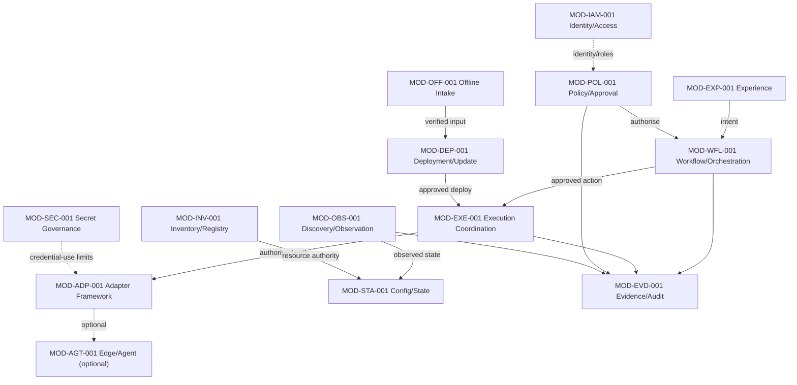
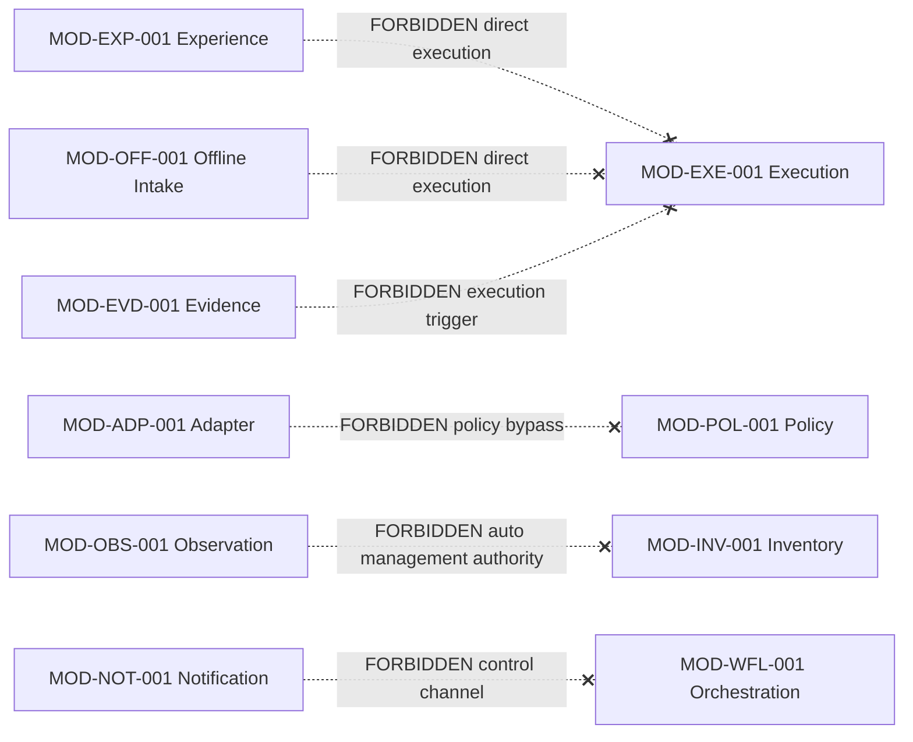

# CoreOps – Logical Module Architecture

> Document Status: Implemented, pending Nova review
> Architecture Status: Foundation logical architecture
> Technology Selection: None
> Deployment Topology: Not selected
> Implementation Status: Not implemented
> Normative Release: Not yet assigned
> Normative Framework: NDF v1.0.0 (Tag `v1.0.0`, Commit `9dcadc1`) — `main` informativ, nicht normativ
> Erzeugt durch `CO-WP-008` (docs-only / logical-architecture foundation)

## 1. Status

Foundation logical module architecture: seventeen technology-independent logical modules with stable IDs, responsibilities, authority boundaries, and dependency rules, derived from the system context, plane taxonomy, capability matrix, and foundation threat model. It selects no technology and prescribes no deployment topology. The module register lives in [COREOPS_MODULE_CATALOG.md](COREOPS_MODULE_CATALOG.md); boundary/dependency rules in [MODULE_BOUNDARY_AND_DEPENDENCY_STANDARD.md](MODULE_BOUNDARY_AND_DEPENDENCY_STANDARD.md).

## 2. Purpose

Give CoreOps a stable logical decomposition so later component and technology decisions can proceed against clear responsibilities, authority boundaries, and security invariants — without prematurely deciding monolith-vs-microservices, language, framework, database, broker, protocol, container, package, deployment, agent transport, cryptography, or authentication.

## 3. Scope

Logical modules; classification; plane relationships; authority separation (policy/control/execution); adapter and agent boundaries; offline/sovereignty boundary; security invariants at module boundaries; two conceptual diagrams.

## 4. Non-Goals

```text
module ≠ microservice
module ≠ process
module ≠ container
module ≠ repository package
module ≠ mandatory deployment unit
```

No technology, protocol, or deployment topology; no implementation; no ADR; no Capability Matrix or threat-file change.

## 5. Architecture Principles

- Separate policy, control, and execution authority.
- Least authority; explicit authorisation for write/execution.
- Authoritative data ownership is explicit; summaries/derived views are never authoritative.
- Read-only never silently gains write authority.
- Adapters isolate vendor specifics; they do not own governance.
- Agents and external services are optional; the core functions offline.
- Security invariants (from `CO-WP-007`) hold at module boundaries; they are design requirements, not implemented controls.

## 6. Relationship to Planes

Each module maps to at least one primary plane ([COREOPS_PLANE_TAXONOMY.md](COREOPS_PLANE_TAXONOMY.md)); several modules may serve one plane; a module may cross planes where its responsibility justifies it. Rejected: `one plane = one module`, `one module = one deployment`, `one module = one microservice`.

## 7. Module Classification

`foundation-core` · `foundation-cross-cutting` · `optional-platform` · `optional-integration` · `profile-dependent` · `future-extension`. Classification is **not** an implementation or support claim. Each module also carries separate Logical Module Status, Implementation Status, Deployment Requirement, Support Status, and Evidence Status (see catalog). In the foundation state no module is implemented or supported without evidence.

## 8. Logical Modules

| Module ID | Name | Classification | Primary plane |
|---|---|---|---|
| MOD-EXP-001 | Experience and Interface | foundation-core | Experience |
| MOD-IAM-001 | Identity and Access Governance | foundation-core | Policy/Governance |
| MOD-POL-001 | Policy, Approval and Exception | foundation-core | Policy/Governance |
| MOD-INV-001 | Inventory and Resource Registry | foundation-core | Data/State |
| MOD-OBS-001 | Discovery and Observation | foundation-core | Observation/Telemetry |
| MOD-TOP-001 | Topology Model | future-extension | Observation |
| MOD-WFL-001 | Workflow and Job Orchestration | foundation-core | Control/Orchestration |
| MOD-EXE-001 | Execution Coordination | foundation-core | Execution/Automation |
| MOD-ADP-001 | Integration and Adapter Framework | optional-integration | Integration/Adapter |
| MOD-AGT-001 | Edge and Agent Coordination | profile-dependent | Edge/Agent (optional) |
| MOD-DEP-001 | Deployment and Update Management | profile-dependent | Control, Execution |
| MOD-STA-001 | Configuration and State | foundation-core | Data/State |
| MOD-SEC-001 | Credential and Secret Governance Boundary | foundation-cross-cutting | Data/State (protected) |
| MOD-EVD-001 | Evidence and Audit | foundation-cross-cutting | Evidence/Audit |
| MOD-NOT-001 | Notification and External Communication | optional-platform | Integration |
| MOD-OFF-001 | Offline Transfer and Artifact Intake | optional-integration | Integration, Trust |
| MOD-EXT-001 | Extension and Plugin Governance | future-extension | Integration, Policy |

Responsibilities, inputs/outputs, allowed/forbidden dependencies, threat/invariant references, and status per module are in [COREOPS_MODULE_CATALOG.md](COREOPS_MODULE_CATALOG.md).

## 9. Module Relationships

- **MOD-EXP-001** presents and validates input; routes intents to control/policy-facing modules; never directly triggers privileged execution.
- **MOD-POL-001** (+ **MOD-IAM-001**) authorises orchestration/execution intent; does not perform target execution.
- **MOD-WFL-001** requests approved execution; does not bypass policy.
- **MOD-EXE-001** hands approved actions to adapter/agent paths; does not mutate policy; enforces executed≠successful.
- **MOD-ADP-001** isolates vendor/protocol specifics; read-first; does not own governance or self-grant write.
- **MOD-OBS-001**/**MOD-TOP-001** supply observed state/topology; do not create management authority.
- **MOD-INV-001**/**MOD-STA-001** own registered resources and configuration/state; observed state does not silently overwrite desired state.
- **MOD-SEC-001** governs secret references and credential-use limits; secrets never surface in logs/events/evidence.
- **MOD-EVD-001** records audit/evidence; has no execution authority.
- **MOD-OFF-001** supplies quarantined/verified inputs; does not directly trigger privileged execution.
- **MOD-AGT-001** optional; agent compromise does not grant global authority.
- **MOD-NOT-001** external comms with minimisation; a notification channel is not a control channel.
- **MOD-EXT-001** governs extensions; plugins do not bypass module contracts.

## 10. Control, Policy and Execution Separation

Policy-to-Action (MOD-POL-001 → intent) and Control-to-Execution (MOD-WFL-001 → MOD-EXE-001) are separate authority boundaries. Approval precedes privileged execution; control intent and execution authority remain separable (threat refs THR-003/004/005/026; invariants 3/4).

## 11. Adapter and Agent Boundaries

Adapters (MOD-ADP-001) translate vendor/protocol specifics and detect capabilities; they never own or bypass global governance and never self-grant write authority (THR-007/010/011; invariant 1). Agents (MOD-AGT-001) are optional; agentless operation remains possible; agent identity/trust is required; compromise is contained, not global (THR-008/009; invariant 16).

## 12. Offline and Sovereignty Boundary

Agents, external cloud, and external identity/time/key/evidence systems are optional integrations; the underlying necessary functions may be provided by local/internal or later technical solutions. Offline-core functions require no permanent cloud connection; online synchronisation is not a silent part of every dependency; offline transfer (MOD-OFF-001) stays controlled and approval-gated (THR-024/025; invariant 12). No full offline implementation is claimed. Consistent with [SOVEREIGNTY_AND_DEPENDENCY_POLICY.md](SOVEREIGNTY_AND_DEPENDENCY_POLICY.md).

## 13. Security Invariants

The 17 invariants from the [Foundation Threat Model](../security/COREOPS_FOUNDATION_THREAT_MODEL.md) §14 apply at module boundaries (see catalog per module). They are **design requirements, not implemented controls**. Highlights: read-only≠write (MOD-ADP/EXE), approval-before-execution (MOD-POL→MOD-EXE), control/execution separable (MOD-WFL/MOD-EXE), unknown≠healthy / stale≠current (MOD-OBS/MOD-STA), queued≠executed≠successful≠compliant (MOD-WFL/MOD-EXE/MOD-EVD), unverified-artifacts-not-trusted / offline-provenance (MOD-OFF/MOD-DEP), no-secret-exposure (MOD-SEC), attributable-audit (MOD-EVD), agent-compromise-not-global (MOD-AGT), recovery-needs-evidence (MOD-DEP).

## 14. Logical Module Diagram

Conceptual, technology-independent, not a deployment topology, not an implementation claim.



## 15. Prohibited Bypass Diagram



## 16. Technology Boundary

No monolith/microservices decision; no language, framework, database, broker, API protocol, container, package structure, deployment topology, agent transport, cryptography, or authentication is selected. These are later ADR-governed decisions. Communication is described only conceptually (request/command/approval/event/observation/state-transition/query/evidence/artifact-reference/notification).

## 17. Compatibility

Additive; consistent with system context, plane taxonomy, capability matrix, threat model, sovereignty policy, and NDF rules. Selects no technology; creates no ADR; changes no Capability Matrix or threat file. Breaking-change potential: low.

## 18. Open Questions

- Which modules co-locate vs. separate physically (later architecture WP + ADRs)?
- Which communication patterns map to which technology (deferred)?
- How are module contracts validated (later)?

## 19. Next Decision

Nova review, then Human-Maintainer commit. Component architecture, technology selection, and deployment topology remain separate later work packages (ADR-governed).
