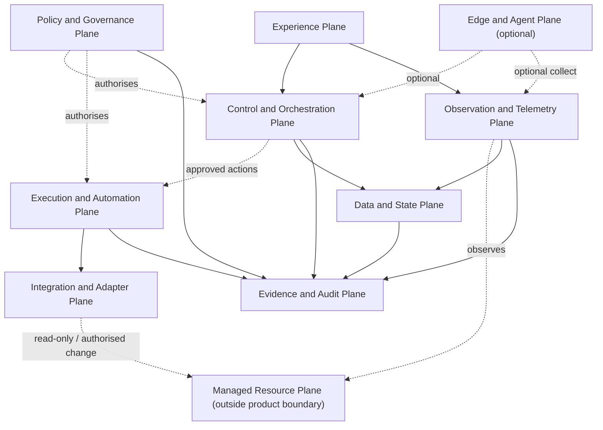

# CoreOps – Plane Taxonomy

> Document Status: Implemented, pending Nova review
> Taxonomy Status: Foundation plane taxonomy
> Physical Separation: Not decided
> Technology Selection: None
> Normative Release: Not yet assigned
> Normative Framework: NDF v1.0.0 (Tag `v1.0.0`, Commit `9dcadc1`) — `main` informativ, nicht normativ
> Erzeugt durch `CO-WP-006` (docs-only / architecture-context foundation)

## 1. Status

Foundation plane taxonomy: ten logical planes that structure later architecture work. Planes are responsibility and data-flow areas, **not** mandatory separate deployments, processes, containers, microservices, or network segments. No technology is selected.

## 2. Purpose

Provide a shared, technology-independent structure so later architecture, security, and component work can reason about responsibilities and data flows without prematurely deciding physical or technical separation.

## 3. Scope

Definition of ten planes, their responsibilities, cross-plane interactions, a conceptual relationship diagram, deployment independence, and offline considerations.

## 4. Plane Definition

A **plane** is a logical area of responsibility and data flow within CoreOps. It groups related concerns; it does not mandate a runtime unit. A plane may later be realized by one or several components, and one component may serve several planes.

## 5. Plane versus Component

```text
plane ≠ process
plane ≠ container
plane ≠ microservice
plane ≠ network segment
plane ≠ mandatory deployment unit
```

Physical and logical separation is a later architecture decision (recorded via ADRs when made).

## 6. Experience Plane

Web UI, CLI, API usage, operator-facing dashboards, help and documentation. No frontend technology selected.

## 7. Control and Orchestration Plane

Desired states; job and workflow orchestration; deployment and change coordination; scheduling; approval gates; rollback coordination. Not claimed as implemented.

## 8. Policy and Governance Plane

Roles; policies; profiles; approvals; scope; risk/exception boundaries; governance decisions. This plane carries the Human-Maintainer and policy authority conceptually.

## 9. Execution and Automation Plane

Execution of approved actions; scripts; update/deployment/maintenance jobs; agent or remote-execution abstraction. No agent technology or transport selected.

## 10. Integration and Adapter Plane

Platform adapters; vendor integrations; API connectors; protocol adapters; import/export interfaces. An adapter implies **no** certified support (adapter presence ≠ support level).

## 11. Observation and Telemetry Plane

Inventory; health; metrics; events; logs; topology observation; state reconciliation input. No monitoring platform is made mandatory.

## 12. Evidence and Audit Plane

Audit events; approvals; change proof; evidence export; integrity and time reference; review support. Evidence capability ≠ requirement satisfaction (see the capability alignment evidence model).

## 13. Data and State Plane

Configuration; inventory data; desired and observed states; job status; metadata; evidence references. No database technology selected.

## 14. Edge and Agent Plane

Optional components near or inside managed environments: agents, relays, proxies, local collectors, offline-bridge components. This plane **must remain optional**; agentless operation must not be excluded.

## 15. Managed Resource Plane

The managed targets: servers, VMs, LXCs, containers, Kubernetes resources, network components, printers, services, applications, storage, and further supported resources. This plane lies **outside** the CoreOps product boundary.

## 16. Cross-Plane Interactions

- Experience → Control/Orchestration: user intents, requests.
- Policy/Governance → all planes: authorises actions, sets scope; Policy-to-Action is a trust boundary.
- Control/Orchestration → Execution: only approved actions cross; Control-to-Execution is a trust boundary.
- Integration/Adapter ↔ Managed Resource: read-only observation and (only when authorised) approved change.
- Observation/Telemetry → Data/State: normalized observations update state; state ≠ ground truth without evidence.
- All planes → Evidence/Audit: produce audit/evidence; Evidence export is a controlled boundary.
- Edge/Agent ↔ Control: optional; agent-to-control is a trust boundary; absence means agentless.

## 17. Plane Relationship Diagram

Conceptual only (not a deployment topology). No technology, no vendor logos, no private environment names.



## 18. Deployment Independence

Planes do not prescribe deployment units. A single-process deployment, a modular monolith, or a distributed set of components could each realize these planes. Physical separation, scaling, and process boundaries are later architecture decisions requiring ADRs.

## 19. Offline Considerations

Core planes (Experience, Control, Policy, Execution, Observation, Evidence, Data/State) must be able to function locally without mandatory cloud. Integration and Edge/Agent planes handle intermittent connectivity via later-defined queueing/synchronisation. Offline/air-gap capability is documented, not claimed as fully implemented (see system context §14).

## 20. Compatibility

Additive; consistent with the system context, sovereignty policy, capability matrix, and NDF rules. Selects no technology; creates no ADR. Breaking-change potential: low.

## 21. Open Questions

- Which planes become separate components vs. remain in one process (later architecture WP)?
- How is the Edge/Agent plane secured when used (later security WP)?
- How is cross-plane state reconciled under intermittent connectivity?

## 22. Next Decision

Nova review, then Human-Maintainer commit. Physical separation and technology selection remain separate later architecture work packages.
