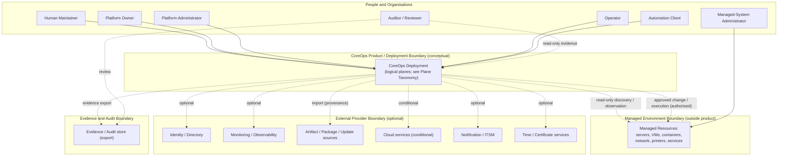

# CoreOps – System Context and External Boundaries

> Document Status: Implemented, pending Nova review
> Context Status: Foundation system context
> Technology Selection: None
> Implementation Status: Not implemented
> Normative Release: Not yet assigned
> Normative Framework: NDF v1.0.0 (Tag `v1.0.0`, Commit `9dcadc1`) — `main` informativ, nicht normativ
> Erzeugt durch `CO-WP-006` (docs-only / architecture-context foundation)

## 1. Status

Foundation system context: a stable, technology-independent description of who and what interacts with CoreOps, the product/deployment/managed boundaries, external system classes, interaction classes, control authority, operating modes, failure behavior, and data classes. It selects no technology and implements nothing.

## 2. Purpose

Give CoreOps a shared architecture-context vocabulary and a clear outer system boundary so later architecture, threat-model, and component work can proceed without ambiguity — without prematurely choosing implementation technologies.

## 3. Scope

Actors and roles; product/deployment/managed/operator/provider/evidence boundaries; external system classes; interaction classes; control authority; connected/restricted/offline modes; failure and degradation boundaries; data classes; a conceptual system-context diagram.

## 4. Non-Goals

- No programming language, database, message queue, API technology, container orchestration, agent technology, network library, concrete cloud, or monitoring solution.
- No detailed component architecture; no threat-model execution; no deployment topology.
- No Capability Matrix change; no ADR.

## 5. Actors and Roles

- **Human Maintainer** — project and repository governance; final technical and governance decisions; commit, push, tag, release. Not equated with a later deployment administrator.
- **Platform Owner** — ownership of a CoreOps deployment; governance configuration; risk acceptance; operator responsibility.
- **Platform Administrator** — technical administration; integrations; maintenance; configuration.
- **Operator** — daily operations; workflows; supervised executions; incident/change activities per permissions.
- **Auditor / Reviewer** — read-only evidence; audit data; decision and change proof.
- **Managed-System Administrator** — responsible for a managed target system; **not** automatically a CoreOps administrator.
- **Automation Client** — e.g. CI/CD, external orchestration, API client, approved workflow caller. No concrete authentication technology selected.

## 6. Product Boundary

The **CoreOps Product Boundary** covers the CoreOps-provided software, specifications, modules, and documented interfaces. It defines what CoreOps *is*, independent of any specific installation.

## 7. Deployment Boundary

The **CoreOps Deployment Boundary** covers a concrete installed CoreOps instance and its locally configured components. Product boundary and deployment boundary are **not** equated: product readiness ≠ deployment configuration/compliance.

## 8. Managed Environment Boundary

The **Managed Environment Boundary** covers systems and resources CoreOps inventories, observes, or controls. Managed resources lie **outside** the CoreOps product boundary; a discovered or connected system is not part of CoreOps.

## 9. Operator Organisation Boundary

The **Operator Organisation Boundary** covers the operator's people, processes, policies, and infrastructure. Operator responsibilities (protection needs, role assignment, retention, legal applicability) live here, not in the product.

## 10. External Provider Boundary

The **External Provider Boundary** covers third parties, cloud services, vendor services, and external APIs. External providers are optional unless explicitly accepted later; a provider connection never becomes a silent core dependency. A separate **Evidence and Audit Boundary** covers generated, exported, or externally stored evidence.

## 11. External System Classes

For each class: Purpose · Direction (in/out/bi) · Data categories · Control authority · Trust assumption · Offline availability · Failure impact · Optional/Required · Future integration target. All are **optional** unless explicitly accepted later; no provider dependency is selected.

| Class | Direction | Control authority | Trust assumption | Offline | Optional/Required |
|---|---|---|---|---|---|
| Virtualisation platforms | bi (read first) | operator-owned target | review-required | online-pref | optional |
| Container platforms | bi (read first) | operator-owned target | review-required | online-pref | optional |
| Orchestration platforms | bi (read first) | operator-owned target | review-required | online-pref | optional |
| Operating systems | bi (read first) | operator-owned target | review-required | degraded | optional |
| Network-management systems | bi (read first) | operator-owned target | review-required | online-pref | optional |
| Printer-management systems | bi (read first) | operator-owned target | review-required | online-pref | optional |
| Identity providers | in/bi | external | review-required | degraded | optional |
| Directory services | in/bi | external | review-required | degraded | optional |
| Monitoring/observability platforms | bi | shared | review-required | degraded | optional (never mandatory) |
| Ticketing/ITSM systems | out/bi | external | review-required | online-pref | optional |
| Source-code and CI/CD systems | bi | external | review-required | online-pref | optional |
| Artifact repositories | in | external | provenance-required | off-cap (via import) | optional |
| Package repositories | in | external | provenance-required | off-cap (via import) | optional |
| Backup systems | bi | shared | review-required | off-cap | optional |
| Notification systems | out | external | review-required | online-pref | optional |
| Cloud services | bi | external | review-required | online-pref | optional (conditional, see sovereignty) |
| Vendor APIs | bi (read first) | external | review-required | online-pref | optional |
| Time services | in | external/local | integrity-required | degraded | optional (local fallback) |
| Certificate and key services | bi | shared | integrity-required | local-pref | optional |
| External evidence stores | out | shared | integrity-required | off-cap | optional |

## 12. Interaction Classes

`read-only discovery` · `observation` · `evidence export` · `configuration recommendation` · `planned change` · `approved change` · `execution` · `deployment` · `update` · `credential or token exchange` · `event ingestion` · `notification` · `synchronisation` · `import` · `export`.

Read-only discovery and observation are clearly separated from write/execution. An integration is **not** write-authorised merely because an API connection exists (read capability ≠ write capability).

## 13. Control Authority

```text
CoreOps may orchestrate only explicitly authorised actions.
```

CoreOps has **no** implicit authority over all discovered resources, imported systems, integrations, users, or external platforms. Conceptual authority states (guidance, not implemented global enums): `discovered` · `registered` · `managed-read-only` · `managed-write-enabled` · `execution-authorised` · `deployment-authorised` · `temporarily-approved` · `suspended` · `decommissioned`.

## 14. Online and Offline Modes

- **Connected Mode** — internet and external services may be available; external integrations remain optional.
- **Restricted or Intermittent Mode** — limited/periodic connectivity; queueing and controlled synchronisation are a later design question; local core function remains required.
- **Offline or Isolated Mode** — no permanent external connection; local administration; local core function; controlled artifact import; local audit/evidence access; no automatic cloud dependency.

Not claimed: all offline functions implemented; suitability for classified networks; support for any arbitrary air-gap tier.

## 15. Failure and Degradation Boundary

Conceptual behavior on: external-API failure; unreachable managed systems; agent failure; missing internet; stale telemetry; missing permissions; faulty time source; unavailable evidence export; adapter incompatibility; partial job failure; conflicting observed state. Ground rules:

```text
unknown must not be interpreted as healthy
stale must not be interpreted as current
discovered must not be interpreted as managed
queued must not be interpreted as executed
executed must not be interpreted as successful
successful must not be interpreted as compliant
```

No concrete retry or queue technology selected.

## 16. Data Classes

For each: Sensitivity · Authoritative source · Expected owner · Typical plane · Export boundary · Retention decision owner · Offline considerations. No concrete retention periods are set.

| Data class | Sensitivity | Typical plane | Export boundary | Retention owner |
|---|---|---|---|---|
| Public project data | low | Experience/Data | public | project governance |
| Configuration metadata | medium | Data/State | controlled | operator |
| Inventory data | medium | Observation/Data | controlled | operator |
| Telemetry data | medium | Observation | controlled | operator |
| Audit data | high | Evidence/Audit | controlled/export-capable | operator |
| Evidence data | high | Evidence/Audit | controlled/export-capable | operator |
| Operational logs | medium/high | Observation/Evidence | redaction-required | operator |
| Credentials and secrets | critical | Data/State (protected) | never exported in the clear | operator |
| Personal data | high | varies | minimised/redacted | operator (legal) |
| Deployment-specific data | medium | Data/State | controlled | operator |
| Vendor data | medium | Integration | provenance-tracked | operator |
| Imported external data | medium | Integration/Data | provenance-required | operator |
| Derived data | medium | Data/State | traceable-to-source | operator |

## 17. System Context Diagram

Conceptual only (not a deployment topology). No vendor logos, no private environment names, no technology.



## 18. Relationship to Security and Governance

Consistent with the [BSI/Public-Sector Readiness Baseline](../security/BSI_AND_PUBLIC_SECTOR_READINESS_BASELINE.md) (responsibility and evidence models), the [Capability Security and Governance Alignment](../security/CAPABILITY_SECURITY_AND_GOVERNANCE_ALIGNMENT.md), the [Sovereignty and Dependency Policy](SOVEREIGNTY_AND_DEPENDENCY_POLICY.md) (no mandatory external control plane), and the [Public Neutrality and Disclosure Policy](../governance/PUBLIC_NEUTRALITY_AND_DISCLOSURE_POLICY.md). Trust boundaries are detailed in [TRUST_DEPLOYMENT_AND_EXECUTION_BOUNDARIES.md](../security/TRUST_DEPLOYMENT_AND_EXECUTION_BOUNDARIES.md); planes in [COREOPS_PLANE_TAXONOMY.md](COREOPS_PLANE_TAXONOMY.md).

## 19. Compatibility

Additive; consistent with the Foundation Scope Lock (located at `docs/governance/FOUNDATION_SCOPE_LOCK.md`), accepted decisions, and NDF rules. Selects no technology; creates no ADR; changes no Capability Matrix. Breaking-change potential: low.

## 20. Open Questions

- Which external system classes are first-integration targets (later WP)?
- How are authority states enforced technically (later policy/execution WP)?
- Which restricted-mode synchronisation model applies (later WP)?

## 21. Next Decision

Nova review, then Human-Maintainer commit. Detailed component architecture, threat model, and technology selection remain separate later work packages.
