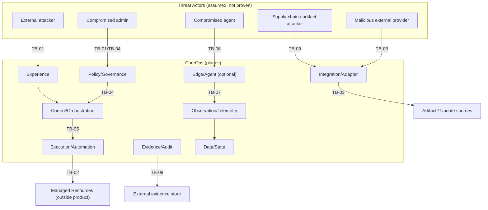
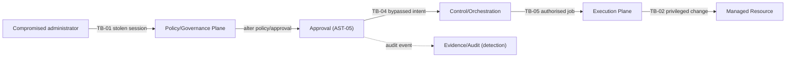

# CoreOps – Foundation Threat Model

> Document Status: Implemented, pending Nova review
> Threat Model Status: Foundation model
> Implementation Status: Not implemented
> Mitigation Validation: Not performed
> Penetration Test Status: Not performed
> Certification Status: None claimed
> Normative Release: Not yet assigned
> Normative Framework: NDF v1.0.0 (Tag `v1.0.0`, Commit `9dcadc1`) — `main` informativ, nicht normativ
> Erzeugt durch `CO-WP-007` (docs-only / security-baseline)

## 1. Status

First systematic foundation threat model for CoreOps, building on the accepted system context, plane taxonomy, and trust boundaries (`CO-WP-006`). It documents assets, threat actors, threat categories, per-plane attack surfaces, trust-boundary threats, threat scenarios (register: [THREAT_SCENARIO_REGISTER.md](THREAT_SCENARIO_REGISTER.md)), abuse cases, and security invariants. **A documented threat model is not an implemented or validated security control.**

## 2. Purpose

Give CoreOps a technology-independent, evidence-bounded threat baseline so later security-architecture work packages can design and validate controls against a shared, authoritative threat inventory.

## 3. Scope

Assets; threat actors; threat categories; attack surfaces per plane; trust-boundary analysis; ≥36 threat scenarios (stable IDs); abuse cases; security invariants; detection/prevention/containment/recovery requirements; offline and supply-chain threats; privacy/disclosure threats; two conceptual diagrams.

## 4. Non-Goals

- No penetration test, network scan, code analysis, or dependency scan.
- No product, cryptography, authentication-protocol, firewall, or network-segment selection.
- No detailed security architecture; no BSI clause-level control mapping; no certification assessment.
- No implemented or validated mitigation; no Capability Matrix change; no ADR.

## 5. Method and Source Boundary

A CoreOps-specific, technology-independent categorization is used (§9). General threat-modeling concepts serve only as methodical inspiration; no external framework text is reproduced. Ratings are qualitative and evidence-bounded (no false numeric precision). Where no deployment exists to measure, likelihood is often `unassessed` and mitigation state is `design-required`/`implementation-required`.

## 6. System Context

Per [SYSTEM_CONTEXT_AND_EXTERNAL_BOUNDARIES.md](../architecture/SYSTEM_CONTEXT_AND_EXTERNAL_BOUNDARIES.md): product ≠ deployment ≠ managed-environment boundary; managed resources outside the product boundary; external providers optional; ten logical planes ([COREOPS_PLANE_TAXONOMY.md](../architecture/COREOPS_PLANE_TAXONOMY.md)); eleven trust boundaries ([TRUST_DEPLOYMENT_AND_EXECUTION_BOUNDARIES.md](TRUST_DEPLOYMENT_AND_EXECUTION_BOUNDARIES.md)).

## 7. Assets

For each asset: class, description, owner/role, primary planes, C/I/A need, audit need, offline considerations, known gaps. No concrete classification tier is invented.

| Asset ID | Asset | Class | Primary planes | C | I | A | Audit |
|---|---|---|---|---|---|---|---|
| AST-01 | Identities and accounts | identity | Policy, Data/State | high | high | medium | high |
| AST-02 | Credentials and secrets | secret | Data/State (protected) | critical | high | medium | high |
| AST-03 | Roles and permissions | authorization | Policy | high | high | medium | high |
| AST-04 | Policies and profiles | governance | Policy | medium | high | medium | high |
| AST-05 | Approvals and exceptions | governance | Policy, Control | high | high | medium | high |
| AST-06 | Desired state | state | Control, Data/State | medium | high | high | high |
| AST-07 | Observed state | state | Observation, Data/State | medium | high | medium | medium |
| AST-08 | Jobs and workflows | execution | Control, Execution | medium | high | high | high |
| AST-09 | Deployment artifacts | artifact | Execution, Integration | high | critical | medium | high |
| AST-10 | Update artifacts | artifact | Execution, Integration | high | critical | medium | high |
| AST-11 | Configuration | config | Data/State | medium | high | medium | high |
| AST-12 | Inventory | data | Observation, Data/State | medium | high | medium | medium |
| AST-13 | Topology data | data | Observation, Data/State | medium | medium | medium | medium |
| AST-14 | Telemetry | data | Observation | medium | medium | medium | medium |
| AST-15 | Logs | data | Observation, Evidence | medium/high | high | medium | high |
| AST-16 | Audit records | evidence | Evidence/Audit | high | critical | high | critical |
| AST-17 | Evidence | evidence | Evidence/Audit | high | critical | high | critical |
| AST-18 | Backup and recovery data | recovery | Data/State, Evidence | high | high | high | high |
| AST-19 | Integration credentials | secret | Integration, Data/State | critical | high | medium | high |
| AST-20 | Agent and adapter identity | identity | Edge/Agent, Integration | high | high | medium | high |
| AST-21 | Source provenance | integrity | Integration, Evidence | high | critical | medium | high |
| AST-22 | Time and sequence information | integrity | all | medium | high | medium | high |
| AST-23 | Risk and decision records | governance | Policy, Evidence | medium | high | medium | high |
| AST-24 | Personal and deployment-specific data | privacy | Data/State | high | high | medium | high |

Known gaps: no asset is implemented; C/I/A needs are design targets, not measured. Offline: assets AST-02/09/10/16/17/18/21 require provenance/integrity for offline transfer.

## 8. Threat Actors

Threat actor presence is a modeling assumption, **not** proof the actor exists or the threat is demonstrated.

`unauthenticated external attacker` · `malicious/compromised authenticated user` · `compromised operator account` · `compromised platform administrator` · `malicious privileged insider` · `accidental operator` · `compromised managed resource` · `compromised agent/relay` · `compromised adapter/integration` · `malicious/compromised external provider` · `software supply-chain attacker` · `artifact/update source attacker` · `network-position attacker` · `stolen backup/evidence recipient` · `malicious automation client` · `environmental/infrastructure failure`.

## 9. Threat Categories

`identity-and-authentication` · `authorization-and-privilege` · `policy-and-approval-bypass` · `execution-and-command-abuse` · `deployment-and-update-integrity` · `agent-and-relay-compromise` · `adapter-and-integration-compromise` · `telemetry-and-observed-state-manipulation` · `inventory-and-topology-manipulation` · `audit-and-evidence-tampering` · `secret-and-credential-exposure` · `offline-import-and-export` · `software-supply-chain` · `data-disclosure-and-privacy` · `availability-and-resource-exhaustion` · `stale-or-inconsistent-state` · `organisational-and-tenant-boundary-failure` · `recovery-and-rollback-failure`.

## 10. Attack Surfaces by Plane

Per plane: entry points · assets · privilege level · trust boundaries crossed · read/write authority · threat categories · failure impact · existing conceptual safeguards · missing safeguards · follow-up. No plane is treated as a mandatory microservice.

- **Experience Plane** — entry: UI/CLI/API; assets AST-01/03/07/15; privilege: user; boundary: user-to-CoreOps; authority: read + request; categories: identity, authz, data-disclosure; missing: authN/session model (design-required); follow-up CO-WP-009.
- **Control and Orchestration Plane** — entry: intents, schedules; assets AST-05/06/08; boundary: policy-to-action, control-to-execution; authority: orchestrate authorised only; categories: policy-bypass, execution-abuse, stale-state; follow-up CO-WP-013.
- **Policy and Governance Plane** — entry: policy/approval changes; assets AST-03/04/05/23; boundary: policy-to-action, privilege; authority: authorise; categories: authz, policy-bypass; follow-up CO-WP-009/013.
- **Execution and Automation Plane** — entry: approved actions, scripts; assets AST-08/09/10; boundary: control-to-execution, CoreOps-to-managed; authority: execute authorised; categories: execution-abuse, deployment-integrity, replay; follow-up CO-WP-013/021.
- **Integration and Adapter Plane** — entry: adapters, API responses; assets AST-12/13/19/21; boundary: CoreOps-to-external, CoreOps-to-managed; authority: read first; categories: adapter-compromise, supply-chain; follow-up CO-WP-014/022.
- **Observation and Telemetry Plane** — entry: telemetry/events; assets AST-07/12/13/14; boundary: telemetry-to-state; authority: read; categories: telemetry-manipulation, stale-state; follow-up CO-WP-012/019.
- **Evidence and Audit Plane** — entry: audit/evidence, export; assets AST-15/16/17; boundary: evidence-export; authority: read/export; categories: audit-tampering, data-disclosure; follow-up CO-WP-018.
- **Data and State Plane** — entry: config/state stores; assets AST-02/06/11/24; boundary: privilege; authority: read/write; categories: secret-exposure, inconsistent-state; follow-up CO-WP-024/011/012.
- **Edge and Agent Plane (optional)** — entry: agents/relays; assets AST-20; boundary: agent-to-control; authority: collect/execute authorised; categories: agent-compromise; missing: agent identity/enrollment; follow-up CO-WP-010.
- **Managed Resource Plane (outside product)** — entry: managed targets; assets AST-12/13; boundary: CoreOps-to-managed; authority: none implicit; categories: managed-resource compromise; follow-up CO-WP-013.

## 11. Trust-Boundary Analysis

Boundary IDs (stable) mirror [TRUST_DEPLOYMENT_AND_EXECUTION_BOUNDARIES.md](TRUST_DEPLOYMENT_AND_EXECUTION_BOUNDARIES.md):

| Boundary ID | Boundary | Key integrity/replay concern | Threat scenarios |
|---|---|---|---|
| TB-01 | user-to-CoreOps | request integrity, session replay | THR-001, THR-002, THR-038 |
| TB-02 | CoreOps-to-managed-environment | authorised change only | THR-005, THR-006, THR-034 |
| TB-03 | CoreOps-to-external-provider | malicious response, provider trust | THR-011, THR-023, THR-039 |
| TB-04 | policy-to-action | approval bypass | THR-003, THR-004 |
| TB-05 | control-to-execution | queued≠executed, replay | THR-026, THR-028, THR-029 |
| TB-06 | agent-to-control-plane | forged/compromised agent | THR-008, THR-009 |
| TB-07 | telemetry-to-state | telemetry manipulation, staleness | THR-012, THR-013, THR-027 |
| TB-08 | evidence-export | wrong recipient, disclosure | THR-018, THR-020, THR-040 |
| TB-09 | online-to-offline transfer | provenance, integrity | THR-024, THR-025 |
| TB-10 | tenant/organisational | cross-tenant leakage | THR-035 |
| TB-11 | privileged-to-non-privileged | escalation | THR-002, THR-037 |

Each boundary: assets crossing, source/destination trust, authorization requirement, integrity/confidentiality/availability threat, replay/sequencing concern, audit requirement, failure behavior (fail-closed), and open decisions are detailed in the boundary document (extended additively, not replaced).

## 12. Threat Scenarios

40 scenarios (THR-001…THR-040) with stable IDs, categories, actors, target assets, entry points, planes, boundaries, ratings, mitigation state, evidence required, owner, and follow-up are maintained in [THREAT_SCENARIO_REGISTER.md](THREAT_SCENARIO_REGISTER.md). No scenario is marked `mitigated`/`closed` without evidence; in the current foundation state none is.

## 13. Abuse Cases

Five end-to-end abuse cases (initial actor · entry point · boundaries crossed · assets · sequence · detection opportunities · prevention · containment · recovery · residual questions):

- **AB-1 Compromised administrator → manipulated policy → privileged job.** Actor: compromised platform administrator. Boundaries: TB-01→TB-04→TB-05→TB-02. Assets: AST-01/04/08. Sequence: stolen admin session → policy/approval altered → privileged job authorised → executed on target. Detection: audit of policy change + approval anomaly. Prevention: SoD, break-glass control, policy-to-action separation. Containment: revoke session, suspend authority. Recovery: rollback + LKG. Residual: authN strength, SoD model (CO-WP-009/013). Scenarios: THR-001/003/002/005.
- **AB-2 Compromised agent → forged telemetry → wrong orchestration.** Actor: compromised agent. Boundaries: TB-06→TB-07→TB-05. Assets: AST-20/07/08. Sequence: agent trust abused → false telemetry → control acts on false state → wrong change. Detection: telemetry anomaly, freshness/consistency checks. Prevention: agent identity, telemetry-to-state integrity, stale≠current. Containment: quarantine agent. Recovery: reconcile state from evidence. Residual: agent enrollment (CO-WP-010). Scenarios: THR-008/012/013.
- **AB-3 Manipulated offline artifact → import → execution.** Actor: artifact/update source attacker. Boundaries: TB-09→TB-05→TB-02. Assets: AST-10/09/21. Sequence: tampered CorePack → offline import without provenance → deployed/executed. Detection: provenance/integrity verification failure. Prevention: signed transfer package, fail-closed import. Containment: revoke artifact, halt deploy. Recovery: rollback. Residual: verification mechanism (CO-WP-022/023). Scenarios: THR-024/021/022.
- **AB-4 Read-only integration → unnoticed write escalation.** Actor: compromised adapter/integration. Boundaries: TB-03→TB-02. Assets: AST-19/12. Sequence: read-only connector abused → write path invoked → target changed unauthorised. Detection: authority-state audit, write attempt on read-only. Prevention: read≠write authority, explicit authorisation. Containment: suspend integration. Recovery: revert change. Residual: authorisation model (CO-WP-013). Scenarios: THR-007/010.
- **AB-5 Audit/evidence manipulation → false compliance impression.** Actor: malicious privileged insider. Boundaries: TB-08→TB-11. Assets: AST-16/17. Sequence: audit records altered/deleted → evidence exported → false compliant impression. Detection: audit integrity/tamper-evidence. Prevention: attributable, integrity-protected audit; SoD. Containment: freeze evidence store. Recovery: restore from protected store. Residual: audit integrity mechanism (CO-WP-018). Scenarios: THR-016/017/030.

## 14. Security Invariants

Binding design requirements (not a claim of implemented enforcement):

```text
1.  Read-only access must not silently gain write authority.
2.  Discovery must not imply management authority.
3.  Policy approval must precede privileged execution.
4.  Control intent and execution authority must remain separable.
5.  Unknown state must not be interpreted as healthy.
6.  Stale state must not be interpreted as current.
7.  Queued must not be interpreted as executed.
8.  Executed must not be interpreted as successful.
9.  Successful must not be interpreted as compliant.
10. Evidence capability must not be interpreted as requirement satisfaction.
11. Unverified artifacts must not be trusted for privileged execution.
12. Offline imports require provenance and integrity verification.
13. Secrets must not be exposed through logs, evidence or reports.
14. Audit-relevant actions require attributable records.
15. Failure of an external provider must not grant broader authority.
16. Agent compromise must not automatically compromise all managed environments.
17. Rollback or recovery claims require test evidence.
```

## 15. Detection Opportunities

Conceptual (mechanisms deferred): policy/approval-change audit; authority-state anomalies (write on read-only); telemetry freshness/consistency checks; agent-identity anomalies; artifact provenance/integrity verification failures; audit-integrity/tamper-evidence; evidence-export authorisation; time-source sanity; resource-usage anomalies. Detection design is later security-architecture work.

## 16. Prevention Requirements

Least privilege; explicit per-target authorisation; separation of policy-to-action and control-to-execution; SoD and break-glass control; provenance/integrity for artifacts and offline imports; secret handling that never exposes secrets in logs/evidence; attributable, integrity-protected audit; fail-closed on unclear authorisation or unavailable safety components. Mechanisms are deferred to later WPs.

## 17. Containment and Recovery

Containment: revoke sessions/authority; quarantine agents/integrations; freeze evidence store; halt deployments. Recovery: rollback and last-known-good; restore from protected backups; reconcile state from evidence. Recovery/rollback claims require test evidence (invariant 17); none is claimed here.

## 18. Offline and Supply-Chain Threats

Offline import without provenance (THR-024); offline export with sensitive data (THR-025); manipulated update/deployment artifacts (THR-021/022); dependency/supply-chain compromise (THR-023). Requirements: signed/verified transfer packages, SBOM/provenance, fail-closed import, controlled export with redaction. Consistent with the sovereignty policy and BSI baseline PSR-14; mechanisms deferred (CO-WP-022/023).

## 19. Privacy and Disclosure Threats

Secret leak in logs/exports (THR-019/020); evidence export to wrong recipient (THR-018); stolen backup/evidence (THR-040); personal-data exposure (AST-24). Requirements: redaction, minimisation, controlled export, no secrets in reports — consistent with the [Public Neutrality and Disclosure Policy](../governance/PUBLIC_NEUTRALITY_AND_DISCLOSURE_POLICY.md) and BSI baseline PSR-15.

## 20. Diagrams

Conceptual only; no vendor logos, no technology, no private environment names; not a claim of complete attack-path coverage.

### 20.1 Threat Surface Overlay



### 20.2 Abuse-Path Diagram (AB-1)



## 21. Risk and Evidence Boundary

Ratings are qualitative and evidence-bounded; no threat is `mitigated`/`closed` without evidence. Threat presence is a modeling assumption, not a demonstrated vulnerability. Project-wide governance risks are tracked in the [Risk Register](../../project-system/RISK_REGISTER.md) (RISK-94…); individual threats live in the threat register, not duplicated as project risks.

## 22. Validation Status

Not validated. No penetration test, scan, or control implementation performed. Invariants and mitigations are requirements/inputs for later security-architecture WPs.

## 23. Compatibility

Additive; extends (not replaces) the trust-boundary model; consistent with system context, plane taxonomy, sovereignty policy, BSI baseline, and NDF rules. No technology selected; no ADR; no Capability Matrix change. Breaking-change potential: low.

## 24. Open Questions

Authentication/session model; SoD and break-glass mechanism; execution/idempotency and replay protection; agent identity/enrollment; artifact/offline provenance verification; audit-integrity mechanism; tenancy model; detection tooling. All are inputs to later security-architecture WPs.

## 25. Next Decision

Nova review, then Human-Maintainer commit. Detailed security architecture, control implementation, and validation (including any penetration testing) remain separate later work packages.
